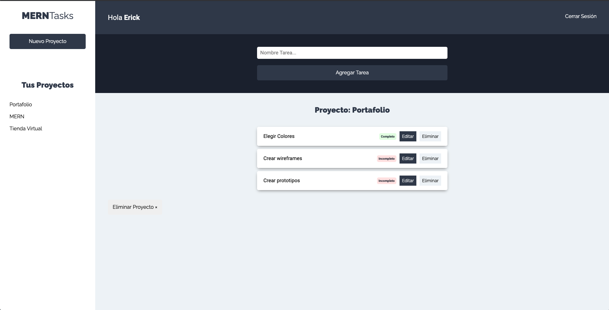

# 💻 MERNTasks (backend)

MERNTasks es un proyecto para administrar tus proyectos y sus tareas, puedes darte de alta, crear nuevos proyectos y crear sus tareas, puedes editar y eliminar tareas además de cambiar su estado de incompleto a completo y viceversa.



## 🛠 Scripts

```bash
# Instalar dependencias
$ npm install

# Encender servidor de desarrollo en localhost:4000
$ npm run dev

# Crear version de producción
$ npm start

```

## 💎 Tecnologías

- NodeJS
- Express
- JSON Web Token
- MongoDB
